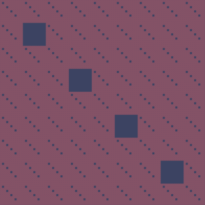
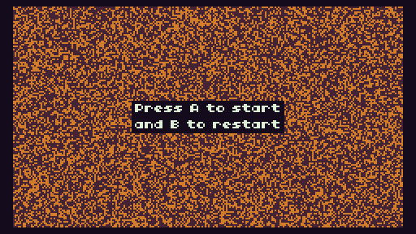

# Creative coding with Nik
> Come and get some inspiration with these creative projects, feel free to clone any repos, make lovely pull requests or send any idea to the tickets!

# Help

All of the projects have tags under the title, so you can use the search functionality (ctrl + f) to find the tags that you find interesting.

# Tickets

Ticket format: [Name of the repo if applies] Resume of the ticket.

---
## Projects

### Sierpinski Carpet Generator
> tool

Create beautiful Sierpinski Carpets fractals with the help of this tool.

[Website](https://carpet.nikcodes.xyz/)

[Source code](https://git.sr.ht/~nik_codes/sierpinski-carpet-generator)

### Game Of Life
> TIC-80, game of life, TS

An implementation of Conway's game of life for the TIC-80 fantasy console, created using [TS](https://github.com/scambier/tic80-typescript).

[Website](https://tic80.com/play?cart=1795)

[Source code](https://git.sr.ht/~nik_codes/game-of-life-tic-80)

